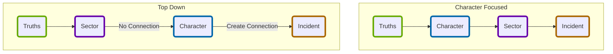

# [[index|Index]]: Campaign Creation
Follow the guided exercises below to create a campaign and characters to embark on duty bound quests within the perilous galaxy of the Forge.  It is recommended to do these in the order listed below, though if you would prefer swapping [[_CRG_Create Your Character|Create Your Character]] with [[_CSG_Sector Creation Summary|Sector Creation]] is possible.

## Campaign Creation Topics
## [[CPG_Prepare for Liftoff|Prepare for Liftoff]]
Introduction to the process for creating a campaign with general guidelines.

## [[_Truths Index|Create Truths]]
Establish the known history and situation for the campaign to begin with.

## [[_CRG_Create Your Character|Create Your Character]]
Creating a player character that will be sworn to complete perilous quests.

## [[_CSG_Sector Creation Summary|Create a Starting Sector]]
Establish a starting location the characters will begin their adventures.

## [[_Starting Adventure Summary|The Inciting Incident]]
Envision the narrative that will drive the character's to overcome obstacles on their journeys.

## Flow of Campaign Creation
Below are two possible flows that can be followed to create a campaign.

## Tags
#Pedia/Campaign

This work is based on Ironsworn: Starforged (found at [www.ironswornrpg.com](http://www.ironswornrpg.com)), created by Shawn Tomkin, and licensed for our use under the Creative Commons Attribution-NonCommercial-ShareAlike 4.0 International license  (creativecommons.org/licenses/by-nc-sa/4.0/).