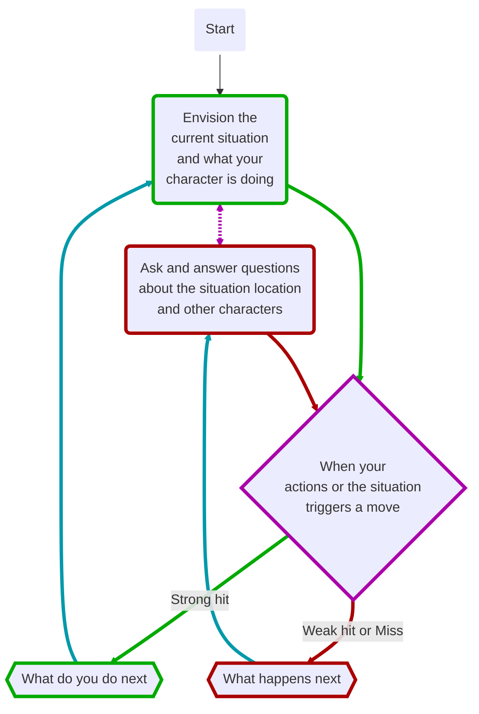

# [[_Gameplay Guidelines Index|Gameplay Rules]]: Making Moves
Moves are self-contained systems to resolve an action, scene, or question. There are moves to cover most uncertain or risky situations you encounter in Starforged. Moves are centered on the players and protagonists. Other characters do not make moves.

## Moves Card
This is the move’s trigger. Triggers are phrased as “when you [blank].” When you do that thing, or encounter that situation, make the move,

Moves requiring [[GP_Action Roll|An Action Roll]] will tell you what stat to add to your roll, and may give you an option to include other bonuses.

Moves with an action roll include three levels of possible results: a strong hit, a weak hit, and a miss.

When a move’s name is referenced within these rules or by another move, you’ll see it as underlined text. If you are reading the Starforged rulebook on a digital device, clicking underlined text will take you to the full summary for that move.

## Moves and Dice
Most moves are based on risky actions from the perspective of your character. You duck behind cover in a gunfight, fly your starship through a dense asteroid field, or give medical care to an ally. These moves use dice to determine the outcome. This is called [[GP_Action Roll|An Action Roll]]. 

A few moves measure your headway against an extended challenge, such as an expedition or fight, using a [[GP_Tracks#Progress Tracks|progress track]]. These are called progress moves. When you are ready to resolve a challenge, you make a progress roll.

Other moves utilize a different kind of dice roll, called an [[GP_Oracles|Oracles Roll]]. These moves help determine the outcome of uncertain events out of your character’s control. 

Some moves don’t require a roll. They might complement or reference a separate move, help you manage your character and their challenges, or support you in managing a session. Don’t roll dice unless a move tells you to. We’ll cover all the [[GP_Action Roll|basic dice rolling mechanics]] in a later page.

## Referencing Moves
Starforged moves are based on the structure created by D. Vincent Baker and Meguey Baker in their Apocalypse World roleplaying game. If you’re familiar with Apocalypse World, or other games using that framework (called Powered by the Apocalypse), you might be surprised by the relatively large number of moves in Starforged.

Don’t be intimidated. You are not expected to memorize Starforged moves. After playing the game for a bit, you’ll start to become familiar with their organization and triggers. They are categorized by activities, which means you tend to focus on a subset of moves for a particular scene. When more than one move seems to apply, use the one most specific to the situation.

Once you understand the basics of rolling dice and managing your character’s resources, as detailed in this chapter, the options and outcomes within moves help create a perilous, propulsive story.

> Reference sheets for moves are available as part of the Starforged Playkit. This print-and-play bundle is available for download at ironswornrpg.com. Use these materials to help guide your actions and resolve the outcome of those actions. Additional details and tips for each move can be found in Chapter 3 ([[_Moves Index|Moves Section]]), but you can save that for when you have questions or are ready to delve deeper

## Making Group Moves
When you are adventuring with allies, protagonists portrayed by other players, one of you often make moves to resolve a challenge for the group. This represents that character taking the lead in a particular scene.

Unless a move specifically offers benefits for your allies, any mechanical bonus you gain from a move is applied only to the character making the move. For example, if you represent your group as you [[MV_Swear an Iron Vow|Swear an Iron Vow]] and score a strong hit, you take the mechanical reward (per the move, “take +2 momentum”). Everyone else benefits from the narrative success. The exception are moves such as [[MV_Sojourn|Sojourn]] with specific options for your allies to take their own benefits.

When you make a move for the group, allies can contribute to your action by making the [[MV_Aid Your Ally|Aid Your Ally (move)]]. If they are successful, you gain a bonus you can leverage to improve your own chance of success. If more than one ally makes this move, bonuses can be stacked. However, keep in mind that moves are inherently risky, and multiple moves will dramatically increase the chance of failure.

When you make a move for your group and face a negative outcome, you should apply mechanical and narrative costs to an individual or the group in a way that best fits the current situation.

> [!quote] Narrative example
> You are at the helm of your starship as you [[MV_Undertake an Expedition|Undertake an Expedition]] across a sector riddled with violent and unpredictable stellar storms. Your allies put their faith in your talents as a pilot, and you take the lead for this segment of the journey. You make the move and roll the dice

## Best Practices For Moves
### Not Everything Is a Move
Don’t let your session jump from move to move without any roleplay, worldbuilding, or storytelling in between. If you’re doing something safe and certain, it’s not a move. If you want to gloss over something, do it.

Many moves offer potential benefits and costs, and it’s ultimately your decision whether to risk the move to gain the reward. If you happen across a planetside settlement in your travels and decide to roleplay some low-key interactions with friendly locals, that’s not a move. However, if you are wounded and your ship is badly damaged, making the [[MV_Sojourn|Sojourn]] move at that settlement gives you an opportunity to recover.

### Making Moves Matter
Let your moves flow organically out of your story. Don’t make moves purely for a mechanical benefit without some support in the fiction. Don’t repeat a move trying to get your desired outcome. A move, hit or miss, should always result in a change to the current situation.

However, there will be times when you make a move multiple times in sequence. In combat, you might attack or defend with consecutive actions. When you are traveling on a long journey, you might roll several times to make progress on the expedition. That’s fine as long as the moves don’t get too mechanical. Break up the flow of play with other actions and narrative beats. When in doubt, follow this guideline: If you’ve made the same move three times in a row, switch things up.

> [!quote] Narrative example
> You are trying to convince a faction leader to agree to an alliance. You roleplay how you attempt to reason with them. Then, you make the [[MV_Compel|Compel (move)]] and fail. They refused. Why? What do you learn or what do they do to make your situation more complex or dangerous? Whatever happens, something happens. You can’t [[MV_Compel|Compel]] them again without new leverage or a different approach.

### Managing Negative Outcomes
Moves can represent escalating danger. A failure on one move might result in a minor complication or hardship, while leading the character into more perilous circumstances. The outcome of additional failures can progressively worsen to show control slipping out of the character’s grasp.

Some moves will make this explicit by giving you a specific bad outcome. Otherwise, ratcheting up the severity of failure is a technique to create increasing tension and danger. Whether you are playing a character or moderating the game as the guide, this is a valuable tool to manage the intensity of the story

## The flow of Play
Like most roleplaying games, you play Starforged primarily from the perspective of your character. What are you doing? What are you trying to achieve? What opposition and challenges do you face? Your quests, and the characters and situations you encounter, will guide the fiction and the choices you make.

When you have questions about what you find, how other characters in your setting respond, or what happens next, you can go with what feels right if you’re playing solo or co-op. If you are playing in guided mode, ask the guide. When you seek inspiration or want to put it in the hands of fate, make the [[MV_Ask the Oracle|Ask the Oracle (move)]]. Use the yes/no questions and random oracle tables to generate interesting twists, complications, locations, and characters you might not have thought of on your own. Above all, if it’s interesting, dramatic and fits the fiction, make it happen.

When you do something or encounter a situation covered by a move, refer to the move. If it tells you to roll dice, do it.

* **Strong hit** means you are in control. You are driving the narrative and taking proactive actions. What do you do next?
* **Weak hit** means the situation is slipping out of your control. Instead of acting, you react. How do you respond?
* **Miss** means you have lost control of the situation. You might need to overcome new dangers or face increasing risk. What happens next?

If you’re playing with a guide, they’ll help determine how the other characters respond and how the situation evolves. They may ask you questions. Otherwise, you rely on your intuition and occasional oracle rolls to drive the narrative.

#consider  *Change flow of diagram, add styles*

## Next Topic: [[GP_Action Roll|The Action Roll]]

### SubTopic: [[GP_Allies_Conflict|Conflict Between Allies (gameplay)]]

## Tags
#Pedia/Gameplay/Moves

This work is based on Ironsworn: Starforged (found at [www.ironswornrpg.com](http://www.ironswornrpg.com)), created by Shawn Tomkin, and licensed for our use under the Creative Commons Attribution-NonCommercial-ShareAlike 4.0 International license  (creativecommons.org/licenses/by-nc-sa/4.0/).