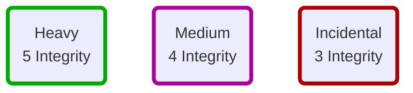

# [[_Gameplay Guidelines Index|Gameplay Rules]]: Vehicles
There are three types of vehicles you’ll rely on as your travel through the perilous depths of the Forge.

## Command Vehicle
Your [[GP_Assets#Command Vehicle|asset type]] is your [[AST_Starship|Starship (asset)]], earned at character creation. It is an interstellar craft capable of faster-than-light travel. If you are playing with others, you and your allies share this asset. If you are playing in solo mode, you can fly the ship as a lone spacer thanks to automation and centralized controls. The command vehicle has an integrity meter, and can suffer from battered or cursed impacts.

#missingArt ==See pages 66–67 for a cutaway illustration of a typical STARSHIP.==

## Support Vehicles
[[GP_Assets#Support Vehicles|Support vehicles]] are assets that represent special secondary vehicles. They can be carried and launched by your [[AST_Starship|Starship (asset)]]. They have an integrity meter, and can suffer from the battered impact.

## Incidental Vehicles
An incidental vehicle is one you temporarily acquire through the course of your story. For example, if you need to journey across the surface of an ocean world, you might borrow a sea-skimmer from a local settlement. Incidental vehicles have an integrity meter, but cannot be marked as battered. When you board an incidental vehicle, envision its nature and assign a max integrity as follows.

If you or an ally aren’t controlling a vehicle, you’re just along for the ride, it’s not an incidental vehicle and does not have an integrity meter.

> When you face off against vehicles (or vehicle-sized foes), consider their relative scale and capabilities as you assign ranks to progress tracks and resolve moves. In some cases, direct attacks are useless. A snub fighter can’t harm a moon-sized station unless there’s a weakness it can exploit. Because NPCs and their vehicles don’t have mechanical detail, always frame the nature of the encounter and your actions as appropriate to the established fiction of the scene.

## Next Topic: [[GP_Navigating the Forge|Navigating the Forge (gameplay)]]

## Tags
#Pedia/Gamplay 

This work is based on Ironsworn: Starforged (found at [www.ironswornrpg.com](http://www.ironswornrpg.com)), created by Shawn Tomkin, and licensed for our use under the Creative Commons Attribution-NonCommercial-ShareAlike 4.0 International license  (creativecommons.org/licenses/by-nc-sa/4.0/).