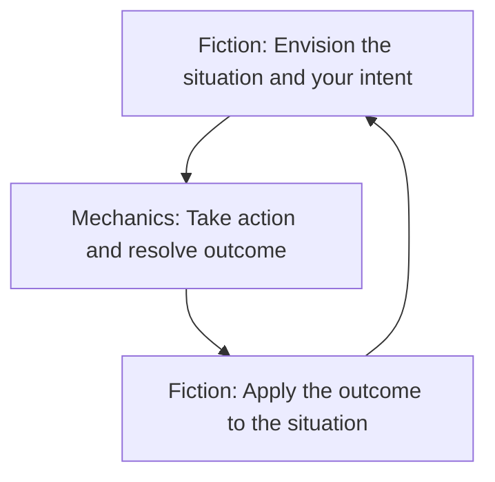

# [[_Gameplay Guidelines Index|Gameplay Rules]]: Mechanics and The Fiction
Starforged is a game. It uses various mechanics, such as rolling dice and managing the resources on your character sheet. As a player, you often make decisions based on a desired mechanical outcome. For example, you might choose a particular action to get a bonus on your die roll. The basic mechanics of Starforged are introduced in this chapter.

Starforged is also heavily reliant on the fiction—the imagined narrative of characters, places, and situations within your game. You envision actions and events in a way that is consistent with the dramatic, fictional reality you have forged for your story and the setting. 

### How Mechanics and Fiction Interact
You start by picturing the situation. What is happening? What are you trying to do? How are you doing it? If you are playing solo, imagine it. If you are playing co-op, talk it out. If you are the guide, set the scene for your players and work with them to add or clarify details.

Then, if a protagonist faces uncertainty or danger, the mechanics help resolve the situation. You roll dice, check the result, and translate that outcome back to the fiction. How does the situation change? What happens next? In this way, the fiction bookends the mechanics.

You’ll learn how the mechanics work in this chapter, but keep in mind this balance between those mechanics and the fiction. Without mechanics, your story lacks choices, consequences and surprises. Without fiction, the game is an exercise in rolling dice. Playing Starforged relies on both the mechanics and the fiction, but leads and follows with the fiction.

> [!note]
> The word “envision” is important. When you see “envision” as a prompt during gameplay, that’s your reminder to take a moment and put the focus on the fiction by imagining, describing, or discussing what is happening. If you’re unsure, you’ll have random prompts and generators to help you.

## Next Topic: [[GS_Principles of Play|Principles of Play]]

## Tags
#Pedia/Gameplay 

This work is based on Ironsworn: Starforged (found at [www.ironswornrpg.com](http://www.ironswornrpg.com)), created by Shawn Tomkin, and licensed for our use under the Creative Commons Attribution-NonCommercial-ShareAlike 4.0 International license  (creativecommons.org/licenses/by-nc-sa/4.0/).