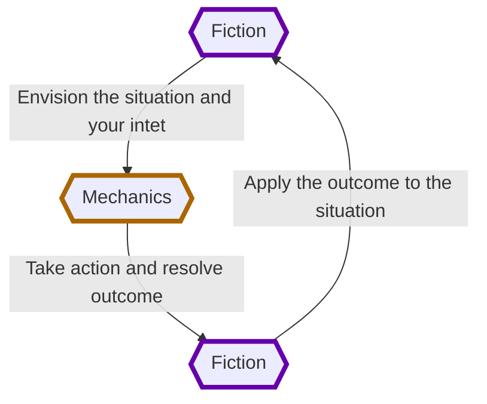

---
## Source
SourceMaterial: "Ironsworn: Starforged"
SourceAuthor: "Shawn Tompkin"
SourceLink: 

## Page
aliases:
  - "Mechanics and the Fiction (the basics)"
PageType: "The Basics"
PageCategory: "Mechanics and the Fiction"
PageOrder: 4
KeyTerms:
  - "Mechanics"
  - "Fiction"
  - "Envision"
  - "Iron Vow"
---
# [[_GB_Index|Gameplay Rules]]: Mechanics and The Fiction
_Starforged_ is a game. It uses various ==mechanics==, such as rolling dice and managing the resources on your character sheet. As a player, you often make decisions based on a desired mechanical outcome. For example, you might choose a particular action to get a bonus on your die roll. The basic mechanics of _Starforged_ are introduced in this chapter.

_Starforged_ is also heavily reliant on the ==fiction==—the imagined narrative of characters, places, and situations within your game. You ==envision== actions and events in a way that is consistent with the dramatic, fictional reality you have forged for your story and the setting. 

## How Mechanics and Fiction Interact
You start by picturing the situation. What is happening? What are you trying to do? How are you doing it? If you are playing solo, imagine it. If you are playing co-op, talk it out. If you are the guide, set the scene for your players and work with them to add or clarify details.

Then, if a protagonist faces uncertainty or danger, the mechanics help resolve the situation. You roll dice, check the result, and translate that outcome back to the fiction. How does the situation change? What happens next? In this way, the fiction bookends the mechanics.

You’ll learn how the mechanics work in this chapter, but keep in mind this balance between those mechanics and the fiction. Without mechanics, your story lacks choices, consequences and surprises. Without fiction, the game is an exercise in rolling dice. Playing _Starforged_ relies on both the mechanics and the fiction, but leads and follows with the fiction.

> The word “envision” is important. When you see “envision” as a prompt during gameplay, that’s your reminder to take a moment and put the focus on the fiction by imagining, describing, or discussing what is happening. If you’re unsure, you’ll have random prompts and generators to help you.

For the people of the Forge, an ==iron vow== is sacred. When you hold a piece of iron and declare your solemn promise to serve or aid someone, or to complete a personal quest, your honor is bound to that vow. Those who undertake these sworn quests are called ==Ironsworn==. Abandoning or recanting an iron vow is the worst sort of failure.

Iron vows are the core of playing _Starforged_. It is your vows that drive you. These goals create the context for your adventures and challenges. As you complete vows, you gain experience and new abilities.

In the campaign launch exercises in the next chapter, you’ll have an opportunity to define the nature of iron vows in your setting.

## Tags
| Previous Page | Tags | Next Page |
|:--- |:---:| ---:|
| **[[GB_Tone and Setting\|Tone and Setting (the basics)]]** | #Pedia/Gameplay | **[[GB_Characters\|Player Characters (the basics)]]** |

This work is based on Ironsworn: Starforged (found at [www.ironswornrpg.com](http://www.ironswornrpg.com)), created by Shawn Tomkin, and licensed for our use under the Creative Commons Attribution-NonCommercial-ShareAlike 4.0 International license  (creativecommons.org/licenses/by-nc-sa/4.0/).