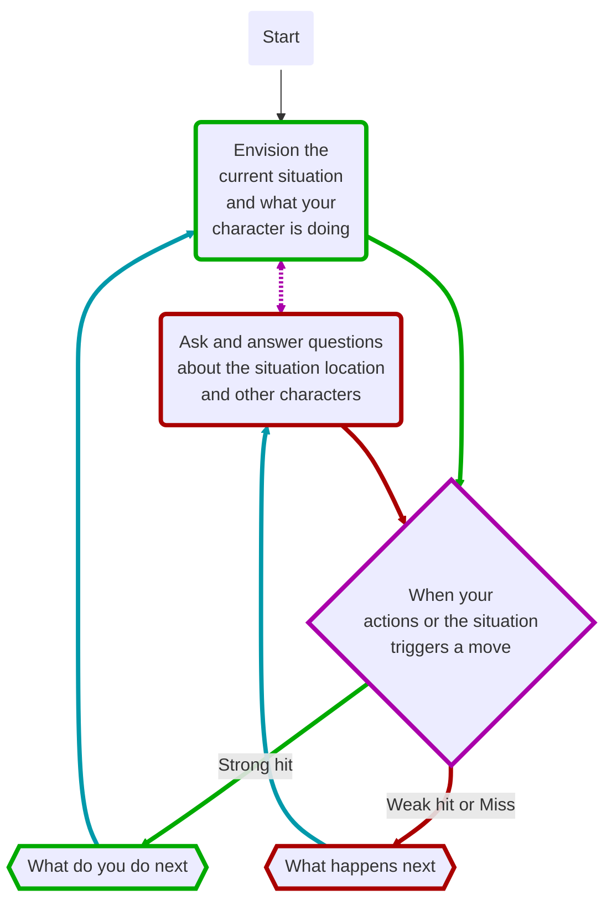

---
## Source
SourceMaterial: "Ironsworn: Starforged"
SourceAuthor: "Shawn Tompkin"
SourceLink: 

## Page
aliases:
  - "The Flow of Play (the basics)"
PageType: "The Basics"
PageCategory: "The Flow Of Play"
PageOrder: 18
---
# [[_GB_Index|Gameplay Rules]]: The Flow of Play
Like most roleplaying games, you play _Starforged_ primarily from the perspective of your character. What are you doing? What are you trying to achieve? What opposition and challenges do you face? Your quests, and the characters and situations you encounter, will guide the fiction and the choices you make.

When you have questions about what you find, how other characters in your setting respond, or what happens next, you can go with what feels right if you’re playing solo or co-op. If you are playing in guided mode, ask the guide. When you seek inspiration or want to put it in the hands of fate, make the [[MV_Ask the Oracle|Ask the Oracle (move)]]. Use the yes/no questions and random oracle tables to generate interesting twists, complications, locations, and characters you might not have thought of on your own. Above all, if it’s interesting, dramatic and fits the fiction, make it happen.

When you do something or encounter a situation covered by a move, refer to the move. If it tells you to roll dice, do it.

* (+)(+) **Strong hit** means you are in control. You are driving the narrative and taking proactive actions. What do you do next?
* (+)(x) **Weak hit** means the situation is slipping out of your control. Instead of acting, you react. How do you respond?
* (x)(x) **Miss** means you have lost control of the situation. You might need to overcome new dangers or face increasing risk. What happens next?

If you’re playing with a guide, they’ll help determine how the other characters respond and how the situation evolves. They may ask you questions. Otherwise, you rely on your intuition and occasional oracle rolls to drive the narrative.

## What's next
That’s the basics of _Starforged_. In the [[_Campaign Index|next chapter]], you’ll define the nature of your setting, create your character, and launch your campaign. If you are playing with others, do those exercises together to forge your universe. Once you begin play, you can refer back to this chapter if you have questions. If you want to learn about a specific game term in a move or asset, check the [[GSRY_Definitions]]

## Tags
| Previous Page | Tags | Next Chapter |
|:--- |:---:| ---:|
| **[[GB_Navigating the Forge\|Navigating The Forge (the basics)]]** | #Pedia/Gameplay/Moves | **[[_Campaign Index\|Campaign Creation]]** |

This work is based on Ironsworn: Starforged (found at [www.ironswornrpg.com](http://www.ironswornrpg.com)), created by Shawn Tomkin, and licensed for our use under the Creative Commons Attribution-NonCommercial-ShareAlike 4.0 International license  (creativecommons.org/licenses/by-nc-sa/4.0/).