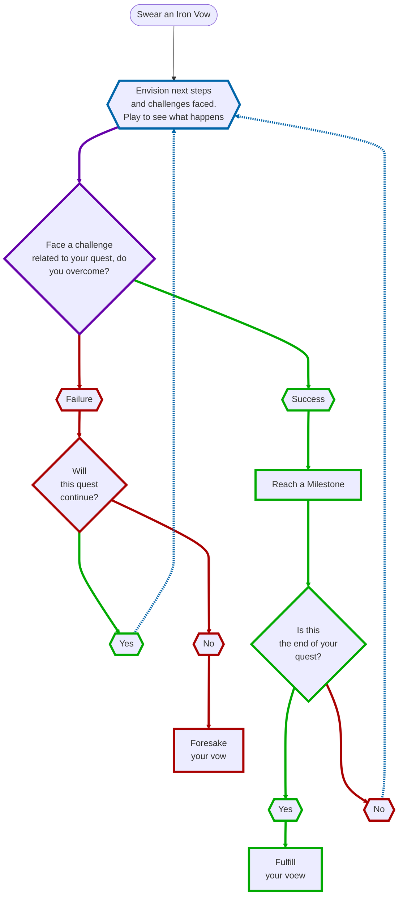

# [[_Moves Index|Moves]] Summary: Quest
```dataview
TABLE without ID
	link(file.link, alias) As "Move Name",
	InlineCmd As "Inline Command",
	RollType As "Roll Type"
WHERE contains(PageType, "Move") & contains(PageCategory, "Quest") & !contains(PageType, "Index")
SORT file.name asc
```
 

In the fiction of the Starforged setting, those who swear vows are the Ironsworn, and their promises are binding. Vows can be made to yourself, as a solemn representation of your personal commitment, or as a promise to someone else. Some vows might be made grudgingly, out of duty, necessity, or tradition. Others will be made with your whole heart. Make these quest moves when you swear vows, make progress on your quests, and resolve vows.

These sworn quests are the narrative engine of your adventures. In pursuit of your vows, you will undertake perilous expeditions, uncover clues, gain the support of others, recover important items, and defeat powerful foes. Your character will struggle to overcome their own limitations and find their preconceptions and loyalties challenged. 

Overcoming obstacles isn’t just for dramatic purposes. Succeeding against trials, finding your way forward, enables you to [[MV_Reach a Milestone|Reach a Milestone (move)]] and mark progress on quests. When you [[MV_Fullfill Your Vow|Fullfill Your Vow (move)]], you gain experience through your quests legacy track that may be spent to improve your character and their resources. 

But not every task or goal is a vow. If a situation is not dramatic or relevant to your character’s goals and principles, it’s probably not worthy of a sworn quest. It might be a milestone for another quest, or simply a narrative diversion as an opportunity for roleplaying or worldbuilding.

To learn more about manage quests see [[_Quest Moves#Managing Multiple Quests|Managing Quests]]

## Quest Flow Chart



## Managing Multiple Quests
It is not necessary to resolve one vow before swearing another. In fact, your character will run afoul of situations and get sidetracked with new vows while they have an ongoing quest. This is the life of the Ironsworn. 

Except on rare occasions, you should not [[MV_Reach a Milestone|Reach a Milestone]] on multiple vows at once. But you might have a quest that serves as a subquest for another. For example, someone might ask you to [[MV_Swear an Iron Vow|Swear an Iron Vow]] to aid them before they agree to help on your own quest. In order to move forward in the main quest, you must [[MV_Fullfill Your Vow|Fullfill Your Vow]] on that new quest. Once that is done, you can Reach a Milestone on the original vow. 

When is an obstacle its own sub-quest instead of just a milestone? Look to the fiction. Is it a significant, self-contained challenge? Does it create opportunities for new drama and conflict? Is it meaningful to your character or to another character who is tasking you with this quest? If so, it’s probably worthy of a vow. 

You will also encounter opportunities for new quests that have no bearing on a current vow. This may happen organically through the fiction, via oracle prompts, or as introduced by your guide in guided play. For example, if you [[MV_Sojourn|Sojourn]] and score a miss, you have the option to introduce a trouble in the community and can [[MV_Swear an Iron Vow|Swear an Iron Vow]] to aid them. 

If you ever find yourself without a quest to pursue, you can enjoy this temporary respite from your sworn obligations. Go explore. Visit a connection. Take on a mundane job that fits your character’s role. You’ll encounter a worthwhile trouble soon enough. If you’re impatient, look to your setting truths and your character’s goals. Kick an ant’s nest. Make something happen.

## Creating a Quest Outline
If you find it helpful, you can envision and write down the potential narrative steps in the quest. Your outline should provide ideas for key challenges, with each step an opportunity to [[MV_Reach a Milestone|Reach a Milestone]]. 

However, you should consider it a sketchy, unreliable plan. It is like an ancient map with “here there be monsters” written in blank spaces. Leave yourself open to surprises, new ideas, input from other players, and the whims of fate.

## Tags
#Pedia/Moves/Quest 

<font size=-2>This work is based on Ironsworn: Starforged (found at [www.ironswornrpg.com](http://www.ironswornrpg.com)), created by Shawn Tomkin, and licensed for our use under the Creative Commons Attribution-NonCommercial-ShareAlike 4.0 International license  (creativecommons.org/licenses/by-nc-sa/4.0/).</font>