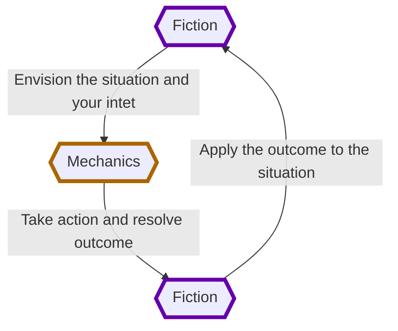

---
## Source
SourceMaterial: "Ironsworn: Starforged"
SourceAuthor: "Shawn Tompkin"
SourceLink: 

## Page
aliases:
  - "Welcome To The Forge (SF The Basics)"
PageType: "The Basics"
PageCategory: "Welcome To The Forge"
PageOrder: 1
---
# [[_Starforged|Starforged]] - [[_SF_CH1_The Basics|Gameplay]]: Welcome to the Forge
In _Ironsworn: Starforged_ (hereafter referred to as _Starforged_), you are a spaceborne hero sworn to undertake perilous quests. You will explore uncharted space, unravel the secrets of a mysterious galaxy, and build bonds with those you meet on your travels. Most importantly, you will swear iron vows and see them fulfilled—no matter the cost.

To play _Starforged_, you make some decisions about the setting and your character, and set your story in motion. When you encounter something dangerous or uncertain, your choices and the dice determine the outcome. 

## Building On the Ironsworn Legacy
_Starforged_ is a standalone sequel to the Ironsworn tabletop roleplaying game. If you’re an experienced Ironsworn player, welcome back! You’ll find some changes and enhancements to suit the spaceborne setting, but the core of the game will be familiar. If you’re new to Ironsworn, this rulebook will give you everything you need to undertake quests in a perilous galaxy. 

## Modes of Play
_Starforged_ offers three ways to play: 
- ==Guided==: One or more players take the role of their characters, the protagonists in your story, while another player is the guide. ==The guide== is sometimes referred to as a gamemaster or GM in other roleplaying games. Instead of playing as one of the protagonists, the guide helps bring the world to life, portrays the people and creatures the protagonists encounter, and works with the other players to decide the outcome of actions and events. 
- ==Cooperative (Co-op)==: You and one or more friends play together to overcome challenges and complete quests. A guide is not required. The _Starforged_ game system will help reveal the nature of locations, characters, and situations you encounter. 
- ==Solo==: As with cooperative play, no guide is necessary. You portray a lone heroic character, using the _Starforged_ game system to explore the dramatic story of your character and their fateful vows.

> _Starforged_ is intended for solo and small group play. One to three players (plus a guide if playing in that mode) is ideal. This rulebook is often written to the perspective of a solo player, but the basic approaches and rules are the same for co-op and guided play.

*17 WELCOME TO THE FORGE*

## Using this Rulebook
You don’t need to read this book cover-to-cover to learn how to play _Starforged_. Here’s a summary for each chapter, and some advice on what to read and when. 

<contents of the book moved to index of this work>

> [!faq] About Key Terms
> Throughout this book, key terms will be ==highlighted== when they are first introduced. If a key term is reintroduced in another important context, it will be ==highlighted== again. See the [[GSRY_Definitions]] for a collection of key terms.

*18 CHAPTER 1: THE BASICS*

## What You Need To Play

You’ll need some dice to play _Starforged_: 
- Two ten-sided dice (d10) for each player. These are challenge dice. 
- One six-sided die (d6) for each player. This is an action die. 
- Optionally, another pair of ten-sided dice to use as oracle dice. You’ll also need some print-and-play materials (available for download at ironswornrpg.com): 
- One set of ==asset cards== (also available for purchase as a preprinted card deck). 
- The ==_Starforged Playkit_==, a set of reference sheets and worksheets.

Finally, you may want a journal or notebook to record your adventure log. 

## Schedule Your Starforged Sessions
If you’re playing solo, a session can be as long as you like, from a few minutes to a few hours. If you’re playing with others, you probably want to dedicate enough time to make some progress in your quests; plan on a couple of hours or more.

> If you prefer to use digital platforms such as a virtual tabletop to play _Starforged_, or some combination of digital and analogue tools, check ironswornrpg.com for links to the most popular resources.

## Tone and Inspiration
_Starforged_ is human-centric science fiction on a perilous frontier. This is a scavenged future, with equipment often cobbled together from salvage. People cling to survival on inhospitable worlds and in remote space stations. Much has been forgotten or lost. It’s a dangerous life for anyone living on this frontier, and doubly so for the Ironsworn—those adventurers bound to sworn quests.

Inspiration comes from the quest-driven stories of The Mandalorian, the lived-in aesthetic and fantasy-infused trappings of the original Star Wars trilogy, the workaday exploits of Firefly, the isolated horror of Alien, the mysticism and faction politics of Dune, the retro-tech and desperation of Battlestar Galactica’s modern reboot, the cosmic mysteries and class struggles of The Expanse, and the gonzo adventures and fantastic locations of Guardians of the Galaxy.

You can bend the tone to your liking. You’ll make a unique version of the setting as you define aspects such as its history, technology, communities, lifeforms, supernatural abilities, and more

*19 WELCOME TO THE FORGE*

## The Setting
Your adventures are set within the ==Forge==. This is a globular cluster in orbit around your people’s home galaxy. It is 1,700 light years above the galactic plane—a bright island in a dark void.

Interstellar nebula span the depths of the Forge, interspersed with denser clouds of vibrant interplanetary dust and strange energies. It is a chaotic galaxy wracked by fiery stellar storms and unpredictable gravitational currents. The planets and stars of this place are born of that chaos.

Your people came to the Forge two centuries ago in the wake of a cataclysm in their home galaxy. Today, this new home offers opportunity and peril. Remnants of ancient civilizations hold dangerous knowledge and forbidden power. Your people build settlements on new worlds, but those places rarely offer a safe haven. Conflicts rage between people and factions. Pirates prowl the spaceways in search of easy prey. Baneful creatures and dark forces dwell on corrupted planets and in the abyssal void between stars.

### Regions of the Forge
Your people divide the Forge broadly into four regions: 
- ==Terminus==: Your people landed in this region following their exodus from their home galaxy. Settlements are common here. Factions compete for resources, and spaceborne caravans follow charted paths among the stars. But the Forge is a vast galaxy; even here, there are still unknown and isolated domains. 
- ==Outlands==: In the last few decades, your people have pushed deeper into the galaxy, searching for habitable planets, resources, and opportunities. Settlements within the Outlands are scattered, and navigation paths are often uncharted. 
- ==Expanse==: A few bold pioneers have delved the far-flung reaches of the Forge. Isolated settlements have been built among these distant domains, but they are usually lost and disconnected from the settled regions. 
- ==Void==: Beyond the Forge, there are only a few isolated stars and vast gulfs of nothing. Travel beyond the periphery of the Forge is difficult or impossible.

> You’ll learn more about the setting and decide the nature of your version of the Forge using the guided exercise in [[_SF_CH2_Contents|Campaign Creation]]

*20 CHAPTER 1: THE BASICS*

#missingArt Galactic diagram of the forge

*21 WELCOME TO THE FORGE*

## Mechanics and The Fiction
_Starforged_ is a game. It uses various ==mechanics==, such as rolling dice and managing the resources on your character sheet. As a player, you often make decisions based on a desired mechanical outcome. For example, you might choose a particular action to get a bonus on your die roll. The basic mechanics of _Starforged_ are introduced in this chapter.

_Starforged_ is also heavily reliant on the ==fiction==—the imagined narrative of characters, places, and situations within your game. You ==envision== actions and events in a way that is consistent with the dramatic, fictional reality you have forged for your story and the setting. 

## How Mechanics and Fiction Interact
You start by picturing the situation. What is happening? What are you trying to do? How are you doing it? If you are playing solo, imagine it. If you are playing co-op, talk it out. If you are the guide, set the scene for your players and work with them to add or clarify details.

Then, if a protagonist faces uncertainty or danger, the mechanics help resolve the situation. You roll dice, check the result, and translate that outcome back to the fiction. How does the situation change? What happens next? In this way, the fiction bookends the mechanics.

You’ll learn how the mechanics work in this chapter, but keep in mind this balance between those mechanics and the fiction. Without mechanics, your story lacks choices, consequences and surprises. Without fiction, the game is an exercise in rolling dice. Playing _Starforged_ relies on both the mechanics and the fiction, but leads and follows with the fiction.

> The word “envision” is important. When you see “envision” as a prompt during gameplay, that’s your reminder to take a moment and put the focus on the fiction by imagining, describing, or discussing what is happening. If you’re unsure, you’ll have random prompts and generators to help you.

*22 CHAPTER 1: THE BASICS*

## Iron Vows

For the people of the Forge, an ==iron vow== is sacred. When you hold a piece of iron and declare your solemn promise to serve or aid someone, or to complete a personal quest, your honor is bound to that vow. Those who undertake these sworn quests are called ==Ironsworn==. Abandoning or recanting an iron vow is the worst sort of failure.

Iron vows are the core of playing _Starforged_. It is your vows that drive you. These goals create the context for your adventures and challenges. As you complete vows, you gain experience and new abilities.

In the campaign launch exercises in the next chapter, you’ll have an opportunity to define the nature of iron vows in your setting.

*23 WELCOME TO THE FORGE*

## Player Characters
You use a ==character sheet== (shown on the opposite page, and available as part of the _Starforged Playkit_) to manage the main aspects of your character. This sheet includes components such as a ==momentum meter==, ==condition meters==, and ==impacts==. We’ll cover these later in this chapter.

The character sheet also includes your ==[[GSRY_Definitions#^stats|stats]]==. These are core to your character’s capabilities, nature, and approach. In the next chapter, you’ll create your character and assign each stat a value from 1 to 3. Then, when things get risky or uncertain, you roll dice and use one of your stats as a bonus. 

The stats are: 
- ==[[GSRY_Definitions#^edge|Edge]]==: quickness, agility, and prowess when fighting at a distance. 
- ==[[GSRY_Definitions#^heart|Heart]]==: courage, willpower, empathy, sociability, and loyalty. 
- ==[[GSRY_Definitions#^iron|Iron]]==: physical strength, endurance, aggressiveness, and prowess when fighting at close quarters
- ==[[GSRY_Definitions#^shadow|Shadow]]==: sneakiness, deceptiveness, and cunning. 
- ==[[GSRY_Definitions#^wits|Wits]]==: expertise, knowledge, and observation. 

Another key aspect of your character is your ==assets==, an example of which is shown below. They are formatted as poker-sized cards. Assets provide ==abilities== that can improve or modify your actions. They are acquired when you create your character and as you gain experience. In this rulebook, asset names are shown in ALL CAPS. You can learn more about [[SF_CH1_Assets|Assets (SF The Basics)]] here.

> [!mechanics]- Navigator Asset Card
> ![[AST_Navigator#^Header]]
> ![[AST_Navigator#^Ability1]]
> ![[AST_Navigator#^Ability2]]
> ![[AST_Navigator#^Ability3]]

*24 CHAPTER 1: THE BASICS*

> Your five ==stats== are given a value from 1 to 3. A stat is often added as a bonus when you take action

> As you fulfill ==vows==, form bonds, and explore the galaxy, you gain ==experience== on ==legacy tracks==.

> The ==condition meters== for ==health==, ==spirit==, and ==supply== represent your overall readiness.

> [!example] Character Sheet
> ![[Character_Template]] %% #consider Do we need this here, or define micro-page link on the character sheet? #migration to different character sheet template #incomplete %%

> Throughout play, you gain and lose ==momentum==. You can use positive momentum to improve the result of an action. Negative momentum can undermine your actions.

> You suffer ==impacts== as you face harrowing challenges. Some impacts are temporary and easily mended; others are permanent.

> ==Vows== are sacred oaths to complete perilous quests. You decide a ==background vow== when you create your character.

*25 WELCOME TO THE FORGE*

### You Are Ironsworn
Your character is not just an array of mechanical bits and bobs. They are a person, grounded in the fiction of your setting. They have hopes and fears, virtues and failings. In the exercises in the next chapter, you’ll create your character and define their nature and background. For now, here are some default assumptions:
- **You are driven**: Many live out their lives barely venturing beyond the shelter of their orbital station or planetside outpost, but you are different. Your sworn ==vows== lead to a life of danger, heroism, and sacrifice at the edge of known space—and beyond. 
- **You are a spacer**: For most, space is lonely, cold, incomprehensibly vast, and full of peril. For you—at least for now—it is home. You have a starship, and the depths of this largely uncharted galaxy call to you. 
- You are competent: You might specialize in a particular career or set of skills, but you are broadly self-reliant and capable. 
- **You are imperfect**: You are not without your limitations. You’ll make bad decisions. You will fail. Fate will conspire against you. Overcoming those hardships, pushing on, is what makes you heroic. 
- **You are unbound**: The default setting is human-centric, and _Starforged_ does not include specific options to play aliens, robots, or other non-human science fiction archetypes. Aside from that consideration, envision your character as you like. There are no gameplay or setting restrictions that constrain your character’s race, culture, disabilities, sexual orientation, or gender identity.

### Other Characters
The mechanics and fiction of _Starforged_ are almost entirely focused on the actions and intent of your character. But you are not alone in the Forge; there are other characters who will take a role in your story. 

- If you are playing a co-op or guided game with other players, their characters are referred to in these rules as your ==allies==. 
- A ==companion== is a special type of ==asset==. They are a person, creature, or robotic helper who accompanies you on your adventures. 
- ==NPCs== (non-player characters and creatures) are the other characters who inhabit your universe. They can have a single mechanical attribute, their ==rank==, to help set their relative scale and abilities. But you do not roll dice for them. When you attempt to influence them, oppose them, or aid them, take action from your character’s perspective. 
- As you explore the Forge and undertake quests, you establish deeper relationships with NPCs—called ==connections==—who become a more vital part of your campaign

*26 CHAPTER 1: THE BASICS*

## Tags
| Chapter Contents | Tags | Next Page |
|:--- |:---:| ---:|
| **[[_SF_CH1_The Basics\|Chapter 1 - The Basics]]** | #Starforged/Gameplay | **[[SF_CH1_Making Moves\|Making Moves (SF The Basics)]]** |

This work is based on Ironsworn: Starforged (found at [www.ironswornrpg.com](http://www.ironswornrpg.com)), created by Shawn Tomkin, and licensed for our use under the Creative Commons Attribution-NonCommercial-ShareAlike 4.0 International license  (creativecommons.org/licenses/by-nc-sa/4.0/).