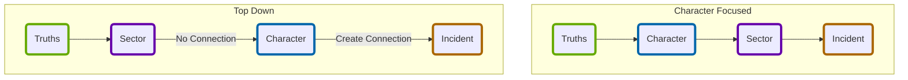

---
## Source
SourceMaterial: "Ironsworn: Starforged"
SourceAuthor: "Shawn Tompkin"
SourceLink: 

## Page
aliases:
  - "Getting Underway (SF Campaign)"
PageType: Campaign
PageCategory: "Getting Underway"
PageOrder: 3
---
# [[_Starforged|Starforged]] - [[_SF_CH2_Contents|Campaign]]: Getting Underway
Ready to go? Work through the exercises in this order.

> 
> - [ ] ![[hexagon_white_num_1.svg|35]] **Choose Your Truths ([[SF_CH2_Choose Your Truths\|page 81]])**
>	Decide what is true for your version of the Forge.

> - [ ] ![[hexagon_white_num_2.svg|35]] **Create Your Character ([[_SF_CH2_Create Your Character\|page 100]])**
>	Set your character’s background, abilities, and characteristics.

> - [ ] ![[hexagon_white_num_3.svg|35]] **Build a Starting Sector ([[_SF_CH2_Build a Starting Sector\|page 114]])**
> 	Create a location to explore at the start of your campaign.

> - [ ] ![[hexagon_white_num_4.svg|35]] **Begin Your Adventure ([[_SF_CH2_Begin Your Adventure\|page 128]])**
> 	Get your story underway as you face an inciting incident and swear an iron vow.
      
One word of warning: You might find your creative batteries running low if you pack the exercises into a single session. Consider breaking each exercise into an individual session, or two exercises per session—whatever works for your group.

Jump to the next page to begin forging your galaxy

*80 CHAPTER 2: LAUNCHING YOUR CAMPAIGN*

## Flow of Campaign Creation
Follow the guided exercises below to create a campaign and characters to embark on duty bound quests within the perilous galaxy of the Forge.  It is recommended to do these in the order listed below, %%#addition%%  _though if you would prefer swapping [[_SF_CH2_Create Your Character|Create Your Character]] with [[_SF_CH2_Build a Starting Sector|Sector Creation]] is possible._

_Below are two possible flows that can be followed to create a campaign._

## Tags
| Previous Page | Tags | Chapter Contents |
|:--- |:---:| ---:|
| **[[SF_CH2_Prepare for Liftoff\|Prepare for Liftoff (campaign)]]** | #Starforged/Campaign | **[[SF_CH2_Choose Your Truths\|Choose Your Truths (SF Campaign)]]** |

This work is based on Ironsworn: Starforged (found at [www.ironswornrpg.com](http://www.ironswornrpg.com)), created by Shawn Tomkin, and licensed for our use under the Creative Commons Attribution-NonCommercial-ShareAlike 4.0 International license  (creativecommons.org/licenses/by-nc-sa/4.0/).11