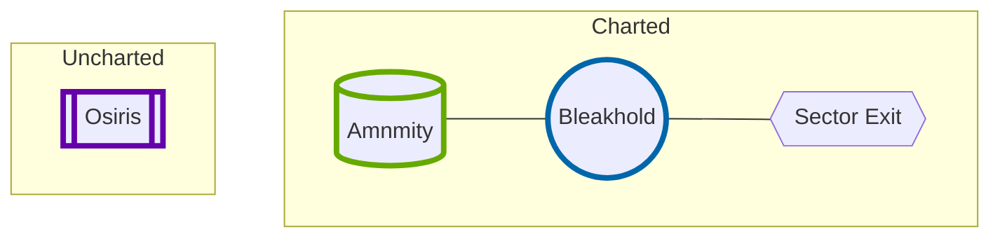

---
## Source
SourceMaterial: "Ironsworn: Starforged"
SourceAuthor: "Shawn Tompkin"

## Page
aliases:
  - "Pre-Generated Sector"
PageType: Campaign
PageCategory: "Sector Creation"
PageOrder: 4
---
# [[_Starforged|Starforged]] - [[_SF_CH2_Contents|Campaign]] - [[_SF_CH2_Build a Starting Sector|Sector]]: Pre-Generated Sector
> [!tip] **Sector name:** Devil’s Maw
> **Region:** Outlands 
> **Sector trouble:** Notorious pirate clan preys on starships ^sector

## Settlements
> [!attention] **Settlement:** Breakhold
> **Location:** Orbital (Ember)
>  **Population:** Hundreds
 > **Authority:** Corrupt
 > **Projects:** Mining, black market
 > **Trouble:** Failing technology
 > **Features:** Repurposed derelict ship 
 > > Built within the decaying husk of an exodus ship, Bleakhold station serves as a launching platform for mining operations on the fiery world below. The miners must brave scorching temperatures and storms of superheated ash, all in the service of a cruel trade guild. ^breakhold

> [!attention] **Settlement:** Amity
> **Location:** Planetside (Pelagic)
> **Population:** Thousands
> **Authority:** Ineffectual
> **Projects:** Festival, subsistence ^amity

> [!attention]  **Settlement:** Osiris
> **Location:** Deep space
> **Population:** Dozens
> **Authority:** Tolerant
> **Projects:** Manufacturing, energy ^osiris
 
## Planets
> [!oracle] **Planet:** Ember
> **Planet Type:** Furnace World
> Atmosphere: Toxic
> Life: Extinct 
> Features: Supervolcano, precursor vault, ash clouds ^ember

> [!oracle] **Planet:** Pelagic
> **Planet Type:** Ocean World ^Pelagic

## Contacts
> [!summary] **Contact:** Gwen Solari
> **Home location:** Bleakhold
> **Rank:** Dangerous
> **Role:** Artifact Smuggler
> **Goal:** Obtain an object
> **Features:** Flashy, Intelligent, Tough
> > Gwen runs a smuggling operation out of Bleakhold Station, transporting illegal precursor artifacts to nearby sectors. She needs help reclaiming a dangerous artifact stolen by pirates ^contact-1

## Map

^map

*127 BUILD A STARTING SECTOR*

## Tags
| Previous Page | Tags | Next Section |
|:--- |:---:| ---:|
| **[[SF_CH2_Enhance A Starting Sector\|Enhance a Starting Sector (SF Campaign)]]** | #Starforged/Campaign/Sector | **[[_SF_CH2_Begin Your Adventure\|Begin Your Adventure (SF Campaign)]]** |

This work is based on Ironsworn: Starforged (found at [www.ironswornrpg.com](http://www.ironswornrpg.com)), created by Shawn Tomkin, and licensed for our use under the Creative Commons Attribution-NonCommercial-ShareAlike 4.0 International license  (creativecommons.org/licenses/by-nc-sa/4.0/).