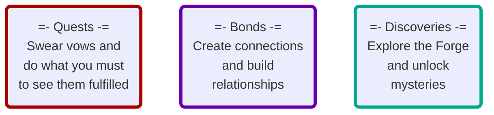

---
## Source
SourceMaterial: "Ironsworn: Starforged"
SourceAuthor: "Shawn Tompkin"
SourceLink: 

## Page
aliases:
  - "Chapter 3 - Gameplay In Depth (SF)"
PageType: "Gameplay In Depth"
PageCategory: Index
PageOrder: 0
---
# [[_Starforged|IRONSWORN: STARFORGED]]
> ## CHAPTER 3
> # GAMEPLAY IN DEPTH
## Contents
| | |
| --- |:---:|
| EXPLORING THE DEPTHS | [[#Exploring the Depths\|Page 139]] |
| SESSION MOVES | [[_SF_CH3_Session Moves\|Page 140]] |
| ADVENTURE MOVES | [[_SF_CH3_Adventure Moves\|Page 146]] |
| QUEST MOVES | [[_SF_CH3_Quest Moves\|Page 154]] |
| CONNECTION MOVES | [[_SF_CH3_Connection Moves\|Page 162]] |
| EXPLORATION MOVES | [[_SF_CH3_Exploration Moves\|Page 168]] |
| COMBAT MOVES | [[_SF_CH3_Combat Moves\|Page 182]] |
| SUFFER MOVES | [[_SF_CH3_Suffer Moves\|Page 198]] |
| RECOVER MOVES | [[_SF_CH3_Recover Moves\|Page 208]] |
| THRESHOLD MOVES | [[_SF_CH3_Threshold Moves\|Page 216]] |
| LEGACY MOVES | [[_SF_CH3_Legacy Moves\|Page 222]] |
| FATE MOVES | [[_SF_CH3_Fate Moves\|Page 228]] |
| ASSET MOVES | [[_SF_CH3_Asset Moves\|From Assets]] |
| CLOCKS | [[SF_CH3_Clocks\|Page 234]] |
| CONFLICT BETWEEN ALLIES | [[SF_CH3_Conflict Between Allies\|Page 242]] |
| PRINCIPLES OF PLAY | [[SF_CH3_Principles of Play\|Page 244]] |

*137*

# Exploring the Depths
In this chapter, we’ll look at _Starforged_ gameplay in more detail. In particular, you’ll find expanded information on framing and resolving the various moves in the game, along with tips and options for customizing your experience.

**Don’t read this chapter front-to-back.** Instead, if you have a question about a specific move, activity, or best-practice, go to that section. Also remember that the moves are available as printable handouts in the Starforged Playkit. Refer to those handouts during your session, and come back to this chapter if you need guidance or want more detail.

## Three Pillars of Play
Through moves, legacy rewards, and narrative prompts, _Starforged_ emphasizes three primary undertakings:  #missingArt _icons on the 3 pillar cards, mermaid is doing pretty good though!_


The ==[[_SF_CH3_Quest Moves|quest moves]]==, ==[[_SF_CH3_Connection Moves|connection moves]]==, and ==[[_SF_CH3_Exploration Moves|exploration moves]]== directly support these gameplay pillars. They are the foundation of your _Starforged_ adventures. Other moves help resolve the moment-to-moment perils and opportunities you encounter through these activities. 

If your story ever feels aimless, without any direction for your character, look to these three pillars. Take a quest. Build a relationship. Go explore. In fact, you’ll often do all three at once as your quest-bound adventures include interactions with key characters and expeditions into the hidden depths of the galaxy. 

Depending on the nature of your character and the assets you bring to bear, you may emphasize one pillar over the others—but none should be ignored. They are your touchstones for compelling, emotional, and surprising stories.

*139 EXPLORING THE DEPTHS*

## All Moves
```dataview
TABLE without ID
	link(file.link, MoveName) As "Move Name",
	InlineCmd As "Inline Command",
	PageCategory As "Move Category",
	RollType As "Roll Type"
WHERE contains(PageType, "Move") & contains(SourceMaterial, "Ironsworn: Starforged") & !contains(PageType, "Index") & !contains(PageCategory, "Index") & !contains(file.path, "Template")
SORT PageCategory asc, file.name asc
```

## Tags
| Previous Chapter | Tags | Next Chapter |
|:--- |:---:| ---:|
| **[[_SF_CH2_Contents\|Chapter 2 - Launching Your Campaign (SF)]]** | #Starforged/Moves | **[[_SF_CH4_Foes-Encounters\|Chapter 4 - Foes and Encounters (SF)]]** |

<font size=-2>This work is based on Ironsworn: Starforged (found at [www.ironswornrpg.com](http://www.ironswornrpg.com)), created by Shawn Tomkin, and licensed for our use under the Creative Commons Attribution-NonCommercial-ShareAlike 4.0 International license  (creativecommons.org/licenses/by-nc-sa/4.0/).</font>