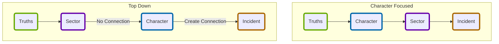

# [[_INDEX|Index]]: Campaign Creation
Follow the guided exercises below to create a campaign and characters to embark on duty bound quests within the perilous galaxy of the Forge.  It is recommended to do these in the order listed below, %%#addition%%  _though if you would prefer swapping [[_CRG_Create Your Character|Create Your Character]] with [[_CSG_Sector Creation Summary|Sector Creation]] is possible._

## Getting Started
## 1 - [[CPG_Prepare for Liftoff|Prepare for Liftoff]]
_Introduction to the process for creating a campaign with general guidelines._

Ready to go? Work through the exercises in this order.

One word of warning: You might find your creative batteries running low if you pack the exercises into a single session. Consider breaking each exercise into an individual session, or two exercises per session— whatever works for your group. Jump to the next page to begin forging your galaxy.

Jump to the next page to begin forging your galaxy

## 2-  [[_Truths Index|Choose Your Truths]]
_Establish the known history and situation for the campaign to begin with._

## 3 - [[_CRG_Create Your Character|Create Your Character]]
_Creating a player character that will be sworn to complete perilous quests._

## 4 - [[_CSG_Sector Creation Summary|Build a Starting Sector]]
_Establish a starting location the characters will begin their adventures._

## 5 - [[_CFG_Starting Adventure Summary|Begin Your Adventure]]
_Envision the narrative that will drive the character's to overcome obstacles on their journeys._

## Flow of Campaign Creation
%% #addition %% _Below are two possible flows that can be followed to create a campaign._

## Tags
| Previous Chapter | Tags | Next Chapter | 
| :--- | :---: | ---: |
| **[[_GB_Index\|Gameplay Rules]]** | #Pedia/Campaign | **[[_Moves Index\|Moves Index]]** |

This work is based on Ironsworn: Starforged (found at [www.ironswornrpg.com](http://www.ironswornrpg.com)), created by Shawn Tomkin, and licensed for our use under the Creative Commons Attribution-NonCommercial-ShareAlike 4.0 International license  (creativecommons.org/licenses/by-nc-sa/4.0/).