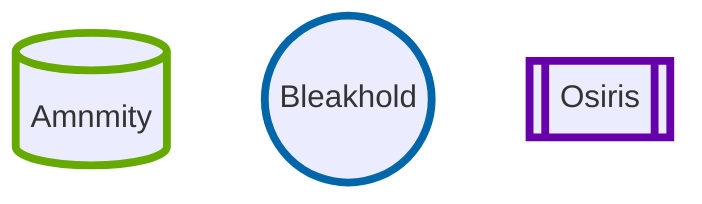
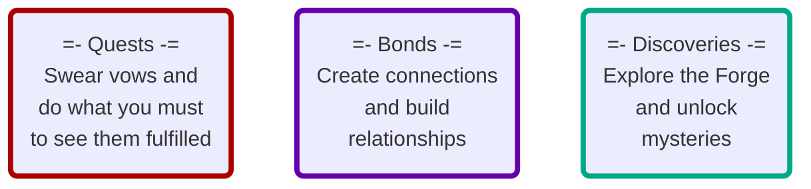

# Diagrams

| Action Die |  | Stat |  | Adds |  | Action Score |
| :---: | :---: | :---: | :---: | :---: | :---: | :---: |
| ![[d6-3-t.svg\|80]] | ![[plus-t.svg\|30]] | ![[stat-2-t.svg\|80]] | ![[plus-t.svg\|30]] | ![[add-1-t.svg\|80]] | ![[equals-t.svg\|30]] | ![[total-6-t.svg\|80]] |
^action-roll-diagram-1

| Action Score | Compare | Challege Dice |
| :---: | :---: | :---: |
| ![[d6-6-t.svg\|80]] | Does the action score beat the challenge dice? | ![[d10-4-t.svg\|80]]![[answer-yes.svg\|30]]![[d10-6-t.svg\|80]]![[answer-no.svg\|30]] |
^action-roll-diagram-2

| Action Score | Momentum | Challenge Dice |
| :---: | :---: | :---: |
| ![[d6-4-t.svg\|80]] | ![[total-7-t.svg\|80]] | ![[d10-5-t.svg\|80]]![[answer-yes.svg\|30]]![[d10-9-t.svg\|80]]![[answer-no.svg\|30]] |
^momentum-diagram-1

| Momentum | | Action Die | Stat | |  Adds | | Action Score |
| :---: | :---: |  :---: | :---: | :---: | :---: | :---: | :---: |
| (-4) | <-> | ![[d6-4-t.svg\|80]]![[answer-no.svg\|30]] | ![[stat-1-t.svg\|80]] | ![[plus-t.svg\|30]] | ![[add-1-t.svg\|80]] | ![[equals-t.svg\|30]] | ![[total-2-t.svg\|80]] |
^momentum-diagram-2

| Rank | Progress Boxes | Fill Rate |
| --- | :---: | :---: |
| Troublesome | ![[progress-box-4.svg\|50]]![[progress-box-4.svg\|50]]![[progress-box-4.svg\|50]] | 3 boxes |
| Dangerous | ![[progress-box-4.svg\|50]]![[progress-box-4.svg\|50]] | 2 boxes |
| Formidable | ![[progress-box-4.svg\|50]] | 1 box |
| Extreme | ![[progress-box-2.svg\|50]] | 2 ticks |
| Epic | ![[progress-box-1.svg\|50]] | 1 tick |
^progress-track-diagram-1

![[progress-track-0.svg|500]]
^progress-track-diagram-3

![[progress-track-22.svg|500]]
^progress-track-diagram-4

| Progress Score | Compare | Challenge Dice |
| :---: | :---: | :---: |
| ![[progress-5-t.svg\|80]] | Does the progress score beat the challenge dice? | ![[d10-4-t.svg\|80]]![[answer-yes.svg\|30]] ![[d10-5-t.svg\|80]]![[answer-no.svg\|30]] |
^progress-track-diagram-2

##### Quests
|  |  |  |  |  |  |  |  |  | ![[hex-uncheckedG.svg\|15]] 10 |
|:---:|:---:|:---:|:---:|:---:|:---:|:---:|:---:|:---:|:---:|
| ![[progress-box-0.svg\|45]] | ![[progress-box-0.svg\|45]] | ![[progress-box-0.svg\|45]] | ![[progress-box-0.svg\|45]] | ![[progress-box-0.svg\|45]] | ![[progress-box-0.svg\|45]] | ![[progress-box-0.svg\|45]] | ![[progress-box-0.svg\|45]] | ![[progress-box-0.svg\|45]] | ![[progress-box-0.svg\|45]] |
| ![[hex-uncheckedG.svg\|15]]![[hex-uncheckedG.svg\|15]] | ![[hex-uncheckedG.svg\|15]]![[hex-uncheckedG.svg\|15]] | ![[hex-uncheckedG.svg\|15]]![[hex-uncheckedG.svg\|15]] | ![[hex-uncheckedG.svg\|15]]![[hex-uncheckedG.svg\|15]] | ![[hex-uncheckedG.svg\|15]]![[hex-uncheckedG.svg\|15]] | ![[hex-uncheckedG.svg\|15]]![[hex-uncheckedG.svg\|15]] | ![[hex-uncheckedG.svg\|15]]![[hex-uncheckedG.svg\|15]] | ![[hex-uncheckedG.svg\|15]]![[hex-uncheckedG.svg\|15]] | ![[hex-uncheckedG.svg\|15]]![[hex-uncheckedG.svg\|15]] | ![[hex-uncheckedG.svg\|15]]![[hex-uncheckedG.svg\|15]] |
^legacy-track-diagram-1

##### Bonds
|  |  |  |  |  |  |  |  |  | ![[hex-uncheckedG.svg\|15]] 10 |
|:---:|:---:|:---:|:---:|:---:|:---:|:---:|:---:|:---:|:---:|
| ![[progress-box-0.svg\|45]] | ![[progress-box-0.svg\|45]] | ![[progress-box-0.svg\|45]] | ![[progress-box-0.svg\|45]] | ![[progress-box-0.svg\|45]] | ![[progress-box-0.svg\|45]] | ![[progress-box-0.svg\|45]] | ![[progress-box-0.svg\|45]] | ![[progress-box-0.svg\|45]] | ![[progress-box-0.svg\|45]] |
| ![[hex-uncheckedG.svg\|15]]![[hex-uncheckedG.svg\|15]] | ![[hex-uncheckedG.svg\|15]]![[hex-uncheckedG.svg\|15]] | ![[hex-uncheckedG.svg\|15]]![[hex-uncheckedG.svg\|15]] | ![[hex-uncheckedG.svg\|15]]![[hex-uncheckedG.svg\|15]] | ![[hex-uncheckedG.svg\|15]]![[hex-uncheckedG.svg\|15]] | ![[hex-uncheckedG.svg\|15]]![[hex-uncheckedG.svg\|15]] | ![[hex-uncheckedG.svg\|15]]![[hex-uncheckedG.svg\|15]] | ![[hex-uncheckedG.svg\|15]]![[hex-uncheckedG.svg\|15]] | ![[hex-uncheckedG.svg\|15]]![[hex-uncheckedG.svg\|15]] | ![[hex-uncheckedG.svg\|15]]![[hex-uncheckedG.svg\|15]] |
^legacy-track-diagram-2

##### Discoveries
|  | | | | | | | | | ![[hex-uncheckedG.svg\|15]] 10 |
| :---: | :---: | :---: | :---: | :---: | :---: | :---: | :---: | :---: | :---: |
| ![[progress-box-0.svg\|45]] | ![[progress-box-0.svg\|45]] | ![[progress-box-0.svg\|45]] | ![[progress-box-0.svg\|45]] | ![[progress-box-0.svg\|45]] | ![[progress-box-0.svg\|45]] | ![[progress-box-0.svg\|45]] | ![[progress-box-0.svg\|45]] | ![[progress-box-0.svg\|45]] | ![[progress-box-0.svg\|45]] |
| ![[hex-uncheckedG.svg\|15]]![[hex-uncheckedG.svg\|15]] | ![[hex-uncheckedG.svg\|15]]![[hex-uncheckedG.svg\|15]] | ![[hex-uncheckedG.svg\|15]]![[hex-uncheckedG.svg\|15]] | ![[hex-uncheckedG.svg\|15]]![[hex-uncheckedG.svg\|15]] | ![[hex-uncheckedG.svg\|15]]![[hex-uncheckedG.svg\|15]] | ![[hex-uncheckedG.svg\|15]]![[hex-uncheckedG.svg\|15]] | ![[hex-uncheckedG.svg\|15]]![[hex-uncheckedG.svg\|15]] | ![[hex-uncheckedG.svg\|15]]![[hex-uncheckedG.svg\|15]] | ![[hex-uncheckedG.svg\|15]]![[hex-uncheckedG.svg\|15]] | ![[hex-uncheckedG.svg\|15]]![[hex-uncheckedG.svg\|15]] |
^legacy-track-diagram-3

#### Legacy Boxes
|  |
|:---:|
| ![[progress-box-2.svg\|45]] |
| ![[hex-uncheckedG.svg\|15]]![[hex-uncheckedG.svg\|15]] |
^legacy-track-diagram-4

|  |
|:---:|
| ![[progress-box-4.svg\|45]] |
| ![[hex-uncheckedG.svg\|15]]![[hex-uncheckedG.svg\|15]] |
^legacy-track-diagram-5

|  |
|:---:|
| ![[progress-box-4.svg\|45]] |
| ![[hex-checkedG.svg\|15]]![[hex-checkedG.svg\|15]] |
^legacy-track-diagram-6

|  | Misfortunes |  | Lasting Effects |  | Burdens |  | Current Vehicle |
| :---: | --- | :---: | --- | :---: | --- | :---: | --- |
| <input type="checkbox" /> | Wounded | <input type="checkbox" /> | Permanetly Harmed | <input type="checkbox" /> | Doomed | <input type="checkbox" /> | Battered |
| <input type="checkbox" /> | Shaken | <input type="checkbox" /> | Truamatized | <input type="checkbox" /> | Tormented | <input type="checkbox" /> | Cursed |
| <input type="checkbox" /> | Unprepared |  |  | <input type="checkbox" /> | Indebted |  |  |
^impacts-diagram-1

| Other Impacts | <input type="checkbox" /> | <input type=texbox value="EnterImpactHere"> | <input type="checkbox" /> | <input type=texbox value="EnterImpactHere"> |
| --- | --- | --- | --- | --- |
| | | | | |
^impacts-diagram-2

> [!todo] Ability 3
> - [x] When your momentum is at its max, you may attempt great kinetic feats, such as manipulating large objects and creating destructive bursts of concussive force. To do so, reset momentum. 
> 	- Then, as you make a single move fueled by your powers, take an automatic strong hit.
> 	- If you are in a fight, mark progress
> > [!faq]- Possible Moves
> > [[SF_CH3_Aid Your Ally|Aid Your Ally (move)]] - [[SF_CH3_Compel|Compel (move)]] - [[SF_CH3_Face Danger|Face Danger (move)]] - [[SF_CH3_Secure an Advantage|Secure an Advantage (move)]] - [[SF_CH3_Clash|Clash (move)]] - [[SF_CH3_Gain Ground|Gain Ground (move)]] - [[SF_CH3_React Under Fire|React Under Fire (move)]] - [[SF_CH3_Strike|Strike (move)]] - [[SF_CH3_Take Decisive Action|Take Decisive Action (move)]]
^assets-kinetic-ability3

| Oracle Dice |  | Oracle Result |
|:---:| --- |:---:|
| {40} {9} | ---> | [49] |
^oracles-diagram-1

| Oracle Dice |  | Oracle Result |
|:---:| --- |:---:|
| {6} {3}</blue> | ---> | [63] |
^oracles-diagram-2

| Ornithor Class | Multiclass Starship - Typical Components |
| --- | --- |
| Top Deck Fore  | Vehicle Bay with docked shuttle Ladder to access Main Deck Fore |
| Top Deck Aft  | Recessed gun turret (exterior) Gunner's seat |
| Main Deck Fore | Cockpit Crew and passenger quarters Ladder to access top and bottom fore decks |
| Main Deck Aft | Engine Room Main reactor |
| Bottom Deck Fore | Sensor Array / Avionics Bay Research Lab (multi-use compartment) Medbay (multi-use compartment) Airlock |
| Bottom Deck Aft | Cargo-bay Eidolon drive |
| Undercarriage Fore | Forward landing gear bay |
| Undercarriage Aft | Extended loading ramp Rear landing gear bay |
| Wing Port Aft | Power conduit Port engine / thrusters |
| Tail Center | Eidolon field stabilizer array | 
| Wing Starboard Aft | Power conduit Starboard engine / thrusters |
^diagram-vehicles-1

| Name | <input type=texbox value=""> | Characteristics |  |
| --- | --- | --- | --- |
| Pronouns | <input type=texbox value=""> | Look | <input type=texbox value=""> |
| Callsign | <input type=texbox value=""> | Act | <input type=texbox value=""> |
|  |  | Wear | <input type=texbox value=""> |
^character-sheet-names

| Edge | Heart | Iron | Shadow | Wits |
| :---: | :---: | :---: | :---: | :---: |
| 0 | 0 | 0 | 0 | 0 |
^character-sheet-stats

| Momentum | |
|:---:| :---: |
| +10 | <input type="radio" name="momentum" value="10"> |
| +9 | <input type="radio" name="momentum" value="9"> |
| +8 | <input type="radio" name="momentum" value="8"> |
| +7 | <input type="radio" name="momentum" value="7"> |
| +6 | <input type="radio" name="momentum" value="6"> |
| +5 | <input type="radio" name="momentum" value="5"> |
| +4 | <input type="radio" name="momentum" value="4"> |
| +3 | <input type="radio" name="momentum" value="3"> |
| +2 | <input type="radio" name="momentum" value="2"> |
| +1 | <input type="radio" name="momentum" value="1"> |
| 0 | <input type="radio" name="momentum" value="0"> |
| -1 | <input type="radio" name="momentum" value="-1"> |
| -2 | <input type="radio" name="momentum" value="-2"> |
| -3 | <input type="radio" name="momentum" value="-3"> |
| -4 | <input type="radio" name="momentum" value="-4"> |
| -5 | <input type="radio" name="momentum" value="-5"> |
| -6 | <input type="radio" name="momentum" value="-6"> |
| Max | 10 | 
| Reset 2 | 2 |
^character-sheet-momentum

| Health | |
|:---:| --- |
| 5 | <input type="radio" name="health" value="5"> |
| 4 | <input type="radio" name="health" value="4"> |
| 3 | <input type="radio" name="health" value="3"> |
| 2 | <input type="radio" name="health" value="2"> |
| 1 | <input type="radio" name="health" value="1"> |
| 0 | <input type="radio" name="health" value="0"> |
^character-sheet-health

| Spirit | |
|:---:| --- |
| 5 | <input type="radio" name="spirit" value="5"> |
| 4 | <input type="radio" name="spirit" value="4"> |
| 3 | <input type="radio" name="spirit" value="3"> |
| 2 | <input type="radio" name="spirit" value="2"> |
| 1 | <input type="radio" name="spirit" value="1"> |
| 0 | <input type="radio" name="spirit" value="0"> |
^character-sheet-spirit

| Supply | |
|:---:| --- | 
| 5 | <input type="radio" name="supply" value="5">
| 4 | <input type="radio" name="supply" value="4"> |
| 3 | <input type="radio" name="supply" value="3"> |
| 2 | <input type="radio" name="supply" value="2"> |
| 1 | <input type="radio" name="supply" value="1"> |
| 0 | <input type="radio" name="supply" value="0"> |
^character-sheet-supply

| Background Vow | | | | | | | | | | |
| :---: |:---: |:---: |:---: |:---: |:---: |:---: |:---: |:---: |:---: |:---: |:---: |
| <input type=texbox value=""> | __ | __ | __ | __ | __ | __ | __ | __ | __ | __ | __  |
^character-sheet-background-vow

| <input type=texbox value="Sector Name"> | <input type=texbox value="Region"> | <input type=texbox value="Faction Control"> | <input type=texbox value="Sector Trouble"> |
| ---:| --- | ---:| --- |
| Map > | <InsertLinkToMap> | Details > | <InsertLinkTosectorBio> |
| Locations | _ **Name** _ | _ **Type** _ | _ **Blurb** _ |
| Location: |  |  |  |
| Location: |  |  |  |
| Location: |  |  |  |
| Location: |  |  |  |
| Location: |  |  |  |
| Location: |  |  |  |
| Location: |  |  |  |
| Location: |  |  |  |
| Location: |  |  |  |
^worksheet-sector-locations

| Bond ![[hex-uncheckedG.svg\|15]] | Rank: | Troublesome | <input type="radio" name="rank" value="1"> | Dangerous | <input type="radio" name="rank" value="2"> | Formidable | <input type="radio" name="rank" value="3"> | Extreme | <input type="radio" name="rank" value="4"> | Epic | <input type="radio" name="rank" value="5"> |
| --- | --- | :---: | :---: | :---: | :---: | :---: | :---: | :---: | :---: | :---: | :---: |
| Name | <input type=texbox value=""> |  |  |  |  |  |  |  |  |  |  |
| Location | <input type=texbox value=""> |  |  |  |  |  |  |  |  |  |  |
| Role | <input type=texbox value=""> | ![[progress-box-0.svg\|45]] | ![[progress-box-0.svg\|45]] | ![[progress-box-0.svg\|45]] | ![[progress-box-0.svg\|45]] | ![[progress-box-0.svg\|45]] | ![[progress-box-0.svg\|45]] | ![[progress-box-0.svg\|45]] | ![[progress-box-0.svg\|45]] | ![[progress-box-0.svg\|45]] | ![[progress-box-0.svg\|45]] |
| Role | <input type=texbox value=""> |  |  |  |  |  |  |  |  |  |  |
| Goal | <input type=texbox value=""> |  |  |  |  |  |  |  |  |  |  |
| Revealed Aspect | <input type=texbox value=""> |  |  |  |  |  |  |  |  |  |  |
| Revealed Aspect | <input type=texbox value=""> |  |  |  |  |  |  |  |  |  |  |
^worksheet-connections

| Locations | _ **Name** _ | _ **Type** _ | _ **Blurb** _ |
| ---: | --- | ---: | --- |
| Location: | Bleakhold | Settlement (orbital)  | **Pop:** Hundreds **Auth:** Corrupt **Projects:** Mining, Black Market |
^diagram-sector-creation-1

| Locations | _ **Name** _ | _ **Type** _ | _ **Blurb** _ |
| ---: | --- | ---: | --- |
| Location: | Bleakhold | Settlement (orbital)  | **Pop:** Hundreds **Auth:** Corrupt **Projects:** Mining, Black Market   Ember (Furnace World)   **Star:** White dwarf |
^diagram-sector-creation-2

^diagram-sector-map-1

| Locations | _ **Name** _ | _ **Type** _ | _ **Blurb** _ |
| ---:| --- | ---:| --- |
| Location: | Bleakhold | Settlement (orbital) | **Pop:** Hundreds **Auth:** Corrupt **Projects:** Mining, Black Market, Repurposed derelict  Ember (Furnace World) **Atmo:** Toxic **Life:** Extinct Magma seas, supervolcano,  Precursor vault, ash clouds  **Star:** White dwarf | 
^diagram-sector-creation-3

| Bond <input type="checkbox" /> | Rank: | Troublesome | <input type="radio" name="rank" value="1"> |
| --- | --- | --- | --- |
| Name | <input type=texbox value=""> | Progress |  |
| Location | <input type=texbox value=""> |  |  |
| Role | <input type=texbox value="Artifact Smuggler"> |  |  |
| Role | <input type=texbox value=""> |  |  |
^diagram-sector-connection-1

|  | Protect Redhaven from the Raiders |
| --- | --- |
| 1) | Find weapons for the farmers |
| 2) | Teach the farmers to fight |
| 3) | Prepare fortifications |
| 4) | Spy on the raiders to learn their plans |
| 5) | Repel the raider attack |
| 6) | Defeat the raider leader |
|  | Profit??? | ^diagram-quest-moves-1

**Troublesome** ![[hex-checkedG.svg\|20]] ![[hex-uncheckedG.svg\|20]] ![[hex-uncheckedG.svg\|20]] ![[hex-uncheckedG.svg\|20]] ![[hex-uncheckedG.svg\|20]] |
|  **Dangerous**  | ![[hex-checkedG.svg\|20]] ![[hex-checkedG.svg\|20]] ![[hex-uncheckedG.svg\|20]] ![[hex-uncheckedG.svg\|20]] ![[hex-uncheckedG.svg\|20]] |
|  **Formidable**  | ![[hex-checkedG.svg\|20]] ![[hex-checkedG.svg\|20]] ![[hex-checkedG.svg\|20]] ![[hex-uncheckedG.svg\|20]] ![[hex-uncheckedG.svg\|20]] |
|  **Extreme**  | ![[hex-checkedG.svg\|20]] ![[hex-checkedG.svg\|20]] ![[hex-checkedG.svg\|20]] ![[hex-checkedG.svg\|20]] ![[hex-uncheckedG.svg\|20]] |
|  **Epic**  | ![[hex-checkedG.svg\|20]] ![[hex-checkedG.svg\|20]] ![[hex-checkedG.svg\|20]] ![[hex-checkedG.svg\|20]] ![[hex-checkedG.svg\|20]] |
