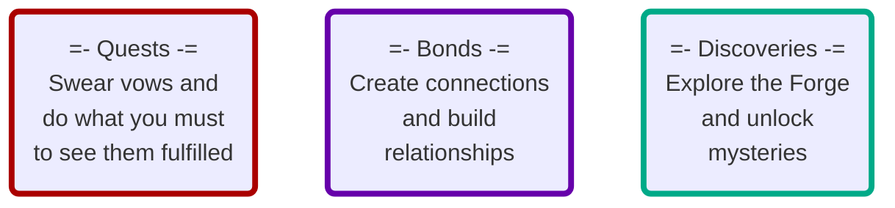

---
## Source
SourceMaterial: "Ironsworn: Starforged"
SourceAuthor: "Shawn Tompkin"
SourceLink: 

## Page
aliases:
  - "Gameplay In Depth"
  - "Moves Index"
---
# [[_INDEX|Index]] - [[_GB_Index|Gameplay]]: in Depth
## Exploring the Depths
In this chapter, we’ll look at _Starforged_ gameplay in more detail. In particular, you’ll find expanded information on framing and resolving the various moves in the game, along with tips and options for customizing your experience.

**Don’t read this chapter front-to-back.** Instead, if you have a question about a specific move, activity, or best-practice, go to that section. Also remember that the moves are available as printable handouts in the Starforged Playkit. Refer to those handouts during your session, and come back to this chapter if you need guidance or want more detail.

## Three Pillars of Play
Through moves, legacy rewards, and narrative prompts, _Starforged_ emphasizes three primary undertakings:  #missingArt _icons on the 3 pillar cards, mermaid is doing pretty good though!_


The ==[[_Quest Moves|quest moves]]==, ==[[_Connection Moves|connection moves]]==, and ==[[_Exploration Moves|exploration moves]]== directly support these gameplay pillars. They are the foundation of your _Starforged_ adventures. Other moves help resolve the moment-to-moment perils and opportunities you encounter through these activities. 

If your story ever feels aimless, without any direction for your character, look to these three pillars. Take a quest. Build a relationship. Go explore. In fact, you’ll often do all three at once as your quest-bound adventures include interactions with key characters and expeditions into the hidden depths of the galaxy. 

Depending on the nature of your character and the assets you bring to bear, you may emphasize one pillar over the others—but none should be ignored. They are your touchstones for compelling, emotional, and surprising stories.

## Moves Categories
| Category | Description |
| --- | --- |
| [[_Session Moves\|Session Moves]] | _Manage the player's enjoyment of a game session._ |
| [[_Adventure Moves\|Adventure Moves]] | _Non-combat moves that are made as the player faces challenges through the story._ |
| [[_Quest Moves\|Quest Moves]] | _Swear and complete vows to persons or for a cause._ |
| [[_Connection Moves\|Connection Moves]] | _Foster relationship with NPC's and mark progress in hope of creating a bond._ |
| [[_Exploration Moves\|Exploration Moves]] | _Traverse space, planets, and mysterious sites to mark progress on expeditions._ |
| [[_Combat Moves\|Combat Moves]] | _Take action in combat encounters to mark progress on objectives._ |
| [[_Suffer Moves\|Suffer Moves]] | _Endure losses to meters on the character sheet._ |
| [[_Recover Moves\|Recover Moves]] | _Restore losses to meters on the character sheet._ |
| [[_Threshold Moves\|Threshold Moves]] | _When dire circumstances might end a character's continuation in the narrative._ |
| [[_Legacy Moves\|Legacy Moves]] | _Obtain and pend experience to enhance your character.  If their journey has come to an end, transfer the campaign to a new character._ |
| [[_Fate Moves\|Fate Moves]] | _Seek inspiration for narrative prompts or decide the price paid when failing._ |
| [[_Scene Moves\|Scene Challenge Moves]] | _Begin a non-combat encounter and face challenges to mark progress on the objective._ |
| [[_Asset Moves\|Asset Moves]] | _Abilities derived from Assets to streamline the documentation and make clear how the ability should be used._ |

## In Depth Guidelines
> **[[GID_Clocks|Clocks]]**
> **[[GID_Allies_Conflict|Conflict Between Allies]]**
> **[[GID_Principles of Play|Principles of Play]]**

## All Moves
```dataview
TABLE without ID
	link(file.link, MoveName) As "Move Name",
	InlineCmd As "Inline Command",
	PageCategory As "Move Category",
	RollType As "Roll Type"
WHERE contains(PageType, "Move") & !contains(PageType, "Index") & !contains(file.path, "Template")
SORT PageCategory asc, file.name asc
```

## Tags
| Previous Chapter | Tags | Next Chapter |
|:--- |:---:| ---:|
| **[[_Campaign Index\|Campaign Creation]]** | #Pedia/Moves | **[[GNPC_Forging NPCs\|Forging NPCs]]** |

<font size=-2>This work is based on Ironsworn: Starforged (found at [www.ironswornrpg.com](http://www.ironswornrpg.com)), created by Shawn Tomkin, and licensed for our use under the Creative Commons Attribution-NonCommercial-ShareAlike 4.0 International license  (creativecommons.org/licenses/by-nc-sa/4.0/).</font>